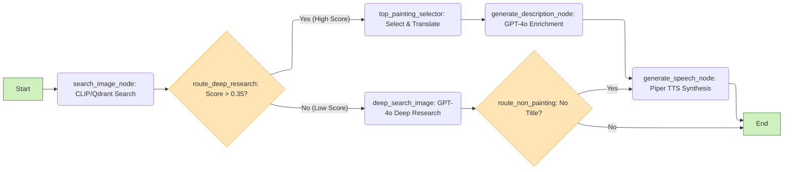

# 🎨 ArtGuide: The AI-Powered Museum Guide

ArtGuide is an AI-driven solution that recognizes artworks instantly and produces smooth, natural audio descriptions to enhance your experience in museums and exhibitions.

## 💻 Technical Overview

**ArtGuide** is a  Python-based application engineered for high performance and accessibility. The core of the system relies on the **ArtGuide AI Agent** (built using the **LangGraph** framework) and a  **QdrantDB** vector database, populated using a **Multiprocessing ETL**. This integrated architecture allows the system to efficiently  **store and retrieve art embeddings** , **make dynamic decisions** based on established guidelines, **generate extra data** as workarts detailed descriptions, and finally, **synthesize the complete guide narration** for delivery.

The system integrates three distinct AI models to power its features:

* **CLIP** for image and text understanding.
* **Piper** for high-quality **Text-to-Speech (TTS)** generation.
* **GPT-4** for sophisticated natural language processing and ArtGuide Agent orchestrator.

Crucially, the **CLIP** and **Piper TTS** models are **self-hosted** on custom infrastructure  a

 distributed through the project's **API** , ensuring low-latency multimedia services.

The entire user interface is built using the **Streamlit** framework for rapid development and is hosted for public access at `https://artguide-dashboard.streamlit.app/`.

<div style="text-align: center;">
  
</div>

## ⚙️ Technical Description

### 🖼️ CLIP and the Qdrant Vector Database

---

The **Contrastive Language-Image Pre-training (CLIP)** model is one of the core intelligence sources in ArtGuide. It is a powerful, **multi-modal model** that was trained by linking corresponding images and text descriptions.

<table style="width: 100%; border-collapse: collapse;">
  <tr>
    <td style="vertical-align: top; padding-right: 20px; width: 65%;">
      <p>
        CLIP is a deep neural network capable of generating high-dimensional vectors (embeddings) that represent both images and text in the <b>same latent space</b>. The power of CLIP lies in its ability to understand the semantic relationship between an image (like an artwork) and any descriptive text. Because it maps them to the same vector space, we can search for a text query (e.g., "painting of a sad dog") and retrieve the most relevant artwork images, and vice-versa.
      </p>
      <p>
        Once the CLIP model converts an artwork image into its high-dimensional vector representation (the embedding), we need a system optimized for <b>Vector Similarity Search (VSS)</b>. QdrantDB allows the ArtGuide Agent to efficiently index and search through millions of art embeddings.
      </p>
      <p>
        For technical reference on the model's architecture, the model can be found on Hugging Face: <a href="https://huggingface.co/openai/CLIP-ViT-Base-Patch32" target="_blank">CLIP-ViT-Base-Patch32</a>
      </p>
    </td>
    <td style="text-align: center; vertical-align: top; width: 35%;">
      
    </td>
  </tr>
</table>

The **CLIP model is deployed via a custom API** to ensure optimal performance and resource efficiency. Since the model is self-hosted, the latency for generating embeddings is minimized compared to relying on loading into memory the model each time an instance of the ArtGuide Agent.

clip-vit-base-patch32)

### 💾 Data Ingestion and ETL

---

The process of populating the Qdrant vector database with high-dimensional embeddings is handled by a dedicated, high-performance **Multiprocessing ETL (Extract, Transform, Load)** pipeline.

The ETL process is managed by concurrent threads and queues to maximize efficiency:

* **Extract:** Queries the **[WikiArt API](https://www.wikiart.org/)** in batches and streams raw data directly to the processing queue, enabling memory-efficient, incremental loading.
* **Transform:** Consumes raw data and performs parallel data enrichment (including **CLIP** embedding generation) using an internal  **multi-thread ThreadPoolExecutor** .
* **Load:** Consumes the fully processed, vectorized data from the final queue and persists it into the **Qdrant vector database** .

```mermaid
---
config:
 layout: elk
---
flowchart LR
    EX["<b>Extract Stage</b><br>
        <i>Main thread</i>"] -. <code>yield</code> .-> TQ[("Transform Queue")]
    TQ --> TR["<b>Transform Stage</b><br>
        <i>TransformWorker Thread</i><br>
       ThreadPoolExecutor"]
    TR -. <code>N workers</code> .-> LQ[("Load Queue")]
    LQ --> LO["<b>Load Stage</b><br>
        <i>LoadWorker Thread</i>"]
    LO --> n2["Qdrant DB"]
    n3["WikiArt Org"] --> EX

    n2@{ img: "https://avatars.githubusercontent.com/u/73504361?s=280&v=4", h: 50, w: 50, pos: "t", constraint: "on"}
    n3@{ img: "https://encrypted-tbn0.gstatic.com/images?q=tbn:ANd9GcTN2um41qphP6s7C4QV6M9B_16cROCOyEi8bg&s", h: 50, w: 50, pos: "t", constraint: "on"}
     EX:::Aqua
     TR:::Peach
     LO:::Sky
    classDef Aqua stroke-width:1px, stroke-dasharray:none, stroke:#46EDC8, fill:#DEFFF8, color:#378E7A
    classDef Peach stroke-width:1px, stroke-dasharray:none, stroke:#FBB35A, fill:#FFEFDB, color:#8F632D
    classDef Sky stroke-width:1px, stroke-dasharray:none, stroke:#374D7C, fill:#E2EBFF, color:#374D7C
```

The design of the ETL pipeline maximizes efficiency through specialized parallelism:

* **Pipeline Parallelism:** Enabled by separate worker threads for the E, T, and L stages, allowing all three to run simultaneously and dramatically increasing throughput.
* **Data Parallelism:** Implemented within the Transform stage to process multiple items concurrently, accelerating the most computationally heavy part of the ETL (embedding generation).
* **Memory Efficiency:** The reliance on small, asynchronous queues and the incremental extraction process prevents system overload when handling large datasets.

### 🎙️ Piper TTS: High-Quality, Self-Hosted Narration

---

The **Piper Text-to-Speech (TTS) model** is the component responsible for generating realistic audio narration.

Piper was strategically chosen because it is a **fast, neural Text-to-Speech system** built upon the **VITS (Conditional Variational Autoencoder with Adversarial Learning for End-to-End Text-to-Speech)** architecture. This foundation allows it to produce clear, natural, and high-fidelity speech. Crucially, the VITS models are converted into the highly optimized. **ONNX (Open Neural Network Exchange) format** for deployment. This conversion maximizes performance for **local, CPU-based inference**

To ensure **low latency** and maintain full control over resources, all Piper models are **downloaded and self-hosted** within ArtGuide's custom API.

The system is configured to support multiple languages and voices, enhancing accessibility. ArtGuide currently utilizes **four distinct model packages** to cover three languages: English, Spanish, and Catalan. The used models are:

* `en_US-libritts` for general male and female english voice.
* `es_ES-sharvard` for general male and female spanish voice.
* `ca_ES-upc_ona` for general female catalan voice.
* `ca_ES-upc_pau` for general male catalan voice.

For more details on the system's open-source development and voice quality, you can refer to the official [Piper GitHub repository](https://github.com/rhasspy/piper) and review the [voice samples](https://rhasspy.github.io/piper-samples/).

### 🧭 ArtGuide Agent: System orchestrator

---

The core of the system is the **`ArtGuide`** class, which implements a **StateGraph** from  **LangGraph**. The agent coordinates three categories of tools and the **GPT-4o** model, which serves as its "brain" for reasoning and content generation.

| **Tool Category** | **Class** | **Function**                                                                                                                                   |
| ----------------------- | --------------- | ---------------------------------------------------------------------------------------------------------------------------------------------------- |
| **API Tools**     | `APITools`    | Interfaces with the project's custom API for low-latency services:**image search (CLIP/Qdrant)** and **speech synthesis (Piper TTS)** . |
| **LLM Tools**     | `LLMTools`    | Groups specific calls to GPT-4o for generating enriched and contextual content.                                                                      |
| **Base Tools**    | `BaseTools`   | Internal utilities for deterministic tasks such as selecting the top result, checking the confidence threshold, and performing translations.         |

The system flow is structured according to the following diagram. The agent employs a two-tiered search strategy to balance efficiency and coverage:

* Deterministic Confidence Check (Initial Search): The system first uses a low-latency CLIP/Qdrant vector search to find artwork in its existing database.
* Extended Deep Search: If the initial search fails to yield a high-confidence result, the system deterministically routes the query to a deep search using GPT-4o. This addresses cases where the painting is not present in the vector database or the image is complex.
* Final Classification: If neither the initial vector search nor the extended deep search returns a satisfactory result, the system concludes that the submitted image is not a painting.

While a deep search using a powerful model like GPT-4o could theoretically be performed directly, the **ArtGuide Agent** prioritizes system economics and efficiency. The **CLIP** model is employed for the initial query because performing **local computation** (vector search) is significantly **more cost-effective** than relying on a third-party API for every query. The expensive **GPT-4o deep search** is reserved only for edge cases or complex queries where the fast, inexpensive vector search has failed, thereby **optimizing operational costs** while maintaining high accuracy.


